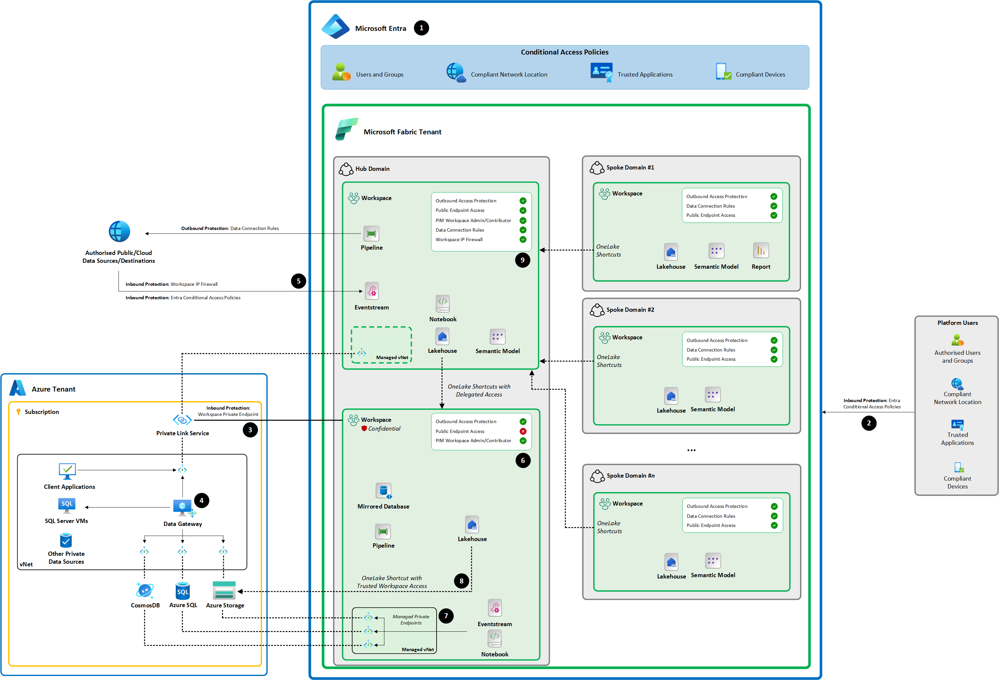

# Implement a secure federated access data platform with Microsoft Fabric

This reference architecture describes how to implement a federated data mesh in a single Microsoft Fabric tenant. A central platform team governs shared capabilities, while business domains own workspaces, data products, and workload operations.

The design uses identity as the primary access perimeter and applies network isolation selectively. This approach preserves interoperability between Fabric workloads while providing stronger controls for data or workloads that require private connectivity. Fabric domains organize and delegate governance, but domain assignment doesn't grant or restrict access. Use workspace roles, item permissions, OneLake security, SQL permissions, and semantic-model security to enforce authorization. See [Fabric domains](https://learn.microsoft.com/fabric/governance/domains) and [Fabric deployment patterns](https://learn.microsoft.com/azure/architecture/data-guide/technology-choices/fabric-deployment-patterns).

> [!IMPORTANT]
> This architecture doesn't establish regulatory compliance. Map the controls to your organization's legal, risk, security, privacy, resilience, and data-residency obligations. Validate the resulting design with the appropriate risk, compliance, and legal functions.

## Architecture goals

Use this architecture to:

- Operate your Fabric tenant as a federated access data platform.
- Delegate data-product ownership to business domains without duplicating the platform.
- Apply consistent identity, classification, auditing, lifecycle, and data-sharing controls.
- Support public HTTPS and software-as-a-service (SaaS) endpoints, Azure services, on-premises systems, and private sources.
- Support batch, incremental, replicated, and streaming ingestion.
- Minimize unnecessary data copies by using OneLake, shortcuts, and mirroring where their security and reliability characteristics meet workload requirements.
- Isolate sensitive or performance-critical workloads without applying private networking to every workspace.
- Align platform operation with the reliability, security, cost optimization, operational excellence, and performance efficiency pillars of the Azure Well-Architected Framework.

## Architecture

| # | Control | Description |
|---|---|---|
| **1** | **Microsoft Entra Conditional Access Policies** | Establishes the identity-first security perimeter for Fabric by evaluating users and groups, network location, trusted applications, device compliance, and other access signals before allowing authentication to Fabric. |
| **2** | **Entra Conditional Access restrictions** | Restricts Fabric access to authorized users connecting from approved corporate networks, VPN egress points, compliant devices, and/or other trusted locations, while retaining Fabric public endpoints. |
| **3** | **Workspace Private Link** | Provides private inbound connectivity to selected sensitive Fabric workspaces through Azure Private Link, allowing public endpoint access to be disabled where network-level isolation is required. |
| **4** | **Data gateway** | Provides controlled connectivity from Fabric to data sources that aren't directly reachable from the Fabric service, including on-premises and private network data sources. |
| **5** | **Workspace IP firewall** | Restricts inbound access to a Fabric workspace to approved public IP addresses or network ranges. It complements Conditional Access when explicit workspace-level network restrictions are required. |
| **6** | **Restricted workspace security controls** | Applies stronger controls to workspaces containing confidential or highly regulated data, such as disabling public endpoint access, enabling outbound access protection, and using PIM for privileged workspace roles. |
| **7** | **Managed virtual network and managed private endpoints** | Provides isolated outbound connectivity from supported Fabric workloads to Azure resources through private endpoints, without exposing those resources through public network paths. |
| **8** | **Trusted workspace access** | Allows a Fabric workspace to securely access firewall-enabled Azure Storage by using the workspace identity and Azure resource-instance rules. This pattern can also support governed OneLake shortcuts to protected storage. |
| **9** | **Workspace outbound access protection and connection controls** | Controls where Fabric workloads can send data by blocking outbound connectivity by default and allowing only approved destinations through mechanisms such as data connection rules and managed private endpoints. |

### Target topology

The topology contains these layers:

1. **Tenant foundation.** A single Microsoft Entra tenant provides the identity and access foundation for the Microsoft Fabric tenant. **Fabric tenant administrators** govern Fabric tenant settings, workload availability, sharing, administrative delegation, and tenant-level monitoring. **Microsoft Entra tenant administrators** govern identity and access controls, including Conditional Access, PIM, access reviews, Entitlement Management, security groups, and workload identities. Together, Entra administrators control **who can access Fabric and under what conditions**, while Fabric administrators control **what those identities can do within the Fabric service and how Fabric capabilities are governed and delegated.**

2. **Capacity layer.** One or more Fabric capacities provide compute and establish region and billing boundaries. Start with shared capacities when workloads can tolerate shared consumption. Place critical, high-volume, or independently funded workloads on separate capacities when performance isolation, residency, or chargeback justifies the additional cost.A recommended placement is:
    * **Platform capacity** – Hosts centrally managed shared services such as common ingestion, shared reference data, governance, monitoring, and reusable platform assets.
    * **Domain production capacities** – Host production data products for one or more business domains. Group domains with compatible performance, security, residency, and business-criticality requirements, and dedicate capacities to high-volume or mission-critical domains where stronger isolation is required.
    * **Nonproduction capacity** – Hosts development and test workspaces across domains, separating engineering activity from production workloads.
    * **Real-time or high-concurrency capacity** – Use a dedicated capacity where Real-Time Intelligence, Eventhouse, Power BI, or other sustained/high-concurrency workloads could materially affect other domain workloads.
    * **Restricted or regulated capacity** – Where required, isolate highly sensitive workloads that have distinct residency, network, operational, or recovery requirements.

3. **Central platform (or Hub) workspaces.** Platform-owned workspaces host shared ingestion frameworks, reusable platform assets, monitoring, administration, and centrally managed semantic or reference data where central ownership is appropriate.

4. **Domain-owned (or Spoke) workspaces.** Each domain owns one or more workspaces containing its data products and workload-specific items. Group these workspaces in a Fabric domain or subdomain for governance and discovery.

5. **Data and consumption layer.** OneLake provides the shared logical data lake. Domain teams publish governed data products for cross-domain consumption through item sharing, OneLake shortcuts, SQL endpoints, semantic models, APIs, or approved external sharing patterns.

Fabric supports multi-workspace patterns on shared or separate capacities. Multiple workspaces on one capacity provide organizational and release isolation but still share compute. Separate capacities add performance, regional, operational, and billing isolation.

### Platform and domain responsibilities

| Responsibility | Central platform team | Domain data-product team |
|---|---|---|
| Tenant and capacity administration | Define tenant settings, approved regions, capacity standards, and delegated controls | Operate within delegated policies |
| Identity | Define group, privileged-access, access-review, and workload-identity standards | Request access and maintain domain membership |
| Workspace lifecycle | Provide naming, ownership, environment, and workspace provisioning standards | Own domain workspace content and permissions |
| Data products | Define minimum metadata, quality, classification, lineage, and endorsement requirements | Build, document, operate, and support data products |
| Networking | Define approved inbound and outbound patterns | Select the approved pattern that matches the workload threat model |
| Operations | Provide monitoring, audit, continuity, and incident-management standards | Monitor domain workloads and meet product objectives |
| Cost | Operate shared capacities and chargeback standards | Optimize domain consumption and justify dedicated capacity |

## Data flow

1. **Acquire data.**
   - Use cloud connections for approved public HTTPS, SaaS, and publicly reachable database endpoints.
   - Use an on-premises data gateway or virtual network data gateway for sources reachable only from an on-premises network or virtual network.
   - Use trusted workspace access with a workspace identity for supported access to firewall-enabled Azure Data Lake Storage Gen2.
   - Use managed private endpoints when supported Fabric workloads must connect privately to Azure resources or a Private Link service.

2. **Ingest batch and incremental data.**
   - Use **Copy job** for guided bulk, incremental, or supported change-data-capture movement.
   - Use **Data Factory pipelines** when ingestion requires orchestration, dependencies, conditions, parameters, or multiple activities.
   - Use **Dataflow Gen2** for low-code Power Query transformations.
   - Use **Spark notebooks or Spark job definitions** for code-first distributed transformation and data engineering.
   - Use **mirroring** for supported operational sources when a continuously synchronized, read-only analytical replica is preferable to a custom ingestion pipeline.

3. **Ingest streaming data.**
   - Use **Eventstreams** to acquire, transform, and route events.
   - Persist and analyze high-volume event, telemetry, log, and time-series data in an **Eventhouse** and its KQL databases.
   - Route selected streams to lakehouses or other supported destinations when batch and real-time workloads need shared data.

4. **Store and process data.**
   - Use a **lakehouse** for open-file data engineering, data science, and mixed structured, semistructured, and unstructured data.
   - Use a **Warehouse** for governed analytical models that require T-SQL development and warehouse semantics.
   - Use **SQL database in Microsoft Fabric** for transactional application data that should integrate with Fabric analytics.
   - Use an **Eventhouse** for event-oriented analytics.
   - Use OneLake shortcuts to reference approved internal or external data without creating an unnecessary copy. Apply permissions to both the shortcut path and target path.

5. **Publish data products.**
   - Publish curated tables, warehouses, Eventhouses, SQL endpoints, semantic models, reports, or APIs with an owner, business definition, classification, service expectations, lineage, support contact, and endorsement state.

6. **Consume across domains.**
   - Prefer governed references to domain-owned source products.
   - Use OneLake shortcuts, shared semantic models, SQL endpoints, or APIs instead of creating unmanaged extracts.
   - Shortcuts don't transfer ownership of the underlying data.

## Identity and access

Use Microsoft Entra security groups rather than individual assignments for routine access. Separate platform administration, workspace administration, data-product engineering, data stewardship, and consumption roles to support segregation of duties.

Apply:

- **Conditional Access** to user access, including multifactor authentication, device, location, session, and risk conditions where required.
- **Privileged Identity Management** for eligible Microsoft Entra and Azure administrative roles.
- **Entitlement Management** for request, approval, expiration, and access-package workflows.
- **Access reviews** for privileged roles, access packages, groups, applications, and service principals where supported.
- **Workload identity Conditional Access** directly to applicable service principals. Managed identities aren't covered by workload-identity Conditional Access, so use their supported governance and review controls instead.

Prefer a **Fabric workspace identity** when a supported Fabric item needs Microsoft Entra authentication to another resource. Fabric manages the identity's credentials and lifecycle. Use a dedicated service principal for automation that isn't supported by workspace identity, and maintain ownership, credential rotation, permissions, monitoring, and decommissioning for every service principal.

### Data authorization

Fabric separates management permissions from data permissions:

- Workspace roles and item permissions govern control-plane actions.
- OneLake security governs supported data-plane access to folders, tables, schemas, rows, and columns.
- Workspace Admin, Member, and Contributor roles already have broad data access. Don't attempt to restrict those users through OneLake security roles; minimize membership in these workspace roles.
- Apply SQL permissions, roles, row-level security, column-level security, object-level security, or dynamic data masking when the SQL access mode and workload require SQL-based enforcement.
- Apply semantic-model permissions and row-level or object-level security for Power BI consumption.
- Validate the effective identity and security path for Direct Lake, DirectQuery, and Import modes.

## Domain access to centrally governed data

Domain-owned workspaces consume centrally governed data products without transferring ownership of the underlying data to the domain. The architecture supports several access patterns, selected according to the location, sensitivity, and consumption requirements of the data:

| Access pattern | Description |
|---|---|
| **OneLake shortcuts** | The preferred pattern for sharing centrally managed Fabric data with domain workspaces. A domain creates a shortcut to an approved data product in the central platform workspace, allowing workloads such as lakehouses, notebooks, and semantic models to use the data without creating another physical copy. The central platform retains ownership of the source data and its lifecycle. |
| **OneLake shortcuts with delegated access** | Where appropriate, the central platform can expose data through a shortcut that uses a delegated or fixed identity to access the target. This pattern is useful when consumers shouldn't require direct permissions on the underlying source. Access to the shortcut and the data exposed through it must still be governed according to the applicable OneLake security model. |
| **Trusted workspace access** | For centrally governed data held in firewall-enabled Azure Storage, a Fabric workspace identity can be authorized through trusted workspace access. This pattern allows Fabric workloads to access protected storage without opening the storage account to general public network access. |
| **Shared semantic models** | Domains that require governed analytical consumption rather than direct data access can consume centrally managed semantic models. This pattern centralizes business definitions, measures, and semantic security while allowing domain teams to create their own reports and analytical experiences. |
| **SQL endpoints and governed query access** | Centrally managed lakehouses and warehouses can expose SQL interfaces to domain consumers. SQL permissions, roles, and row-, column-, or object-level security can restrict the data available to each consuming domain. |
| **Pipelines and controlled replication** | Copy data into a domain workspace when the domain requires physical ownership of a derived data product, independent lifecycle management, workload isolation, or transformations that shouldn't affect the central product. Use this pattern deliberately because it introduces another governed copy of the data. |
| **Cross-workspace Fabric access** | Fabric workloads can reference items across workspaces when the requesting user or workload identity has the required permissions. Use Microsoft Entra groups, workspace identities, item permissions, and OneLake security to govern these interactions rather than granting broad workspace roles. |

The architecture should **prefer governed access over replication**. OneLake shortcuts and shared semantic models provide the primary mechanisms for domain teams to consume centrally governed products while preserving central ownership and reducing unnecessary copies. Physical replication through pipelines should be reserved for cases where **performance, isolation, transformation, resilience, or regulatory requirements** justify a separate copy.

This model also preserves the Data Mesh principle of **federated ownership**: the central platform can own authoritative enterprise or shared data products, while domain teams independently combine those products with domain-owned data to create new products. Access is granted at the appropriate data or item layer rather than by making domain users Contributors or Members of the central platform workspace.

## Governance and data protection

Use Fabric domains to group workspaces, delegate permitted settings, and improve discovery.

> [!IMPORTANT]
> Don't treat Fabric domains as authorization boundaries. Visibility and access are determined by workspace roles and item permissions, not domain assignment.

Apply these controls:

- Use OneLake catalog for discovery, lineage, ownership, endorsement, and governance insights.
- Define certification criteria for trusted data products and delegate certification only to accountable subject-matter authorities.
- Apply Microsoft Purview sensitivity labels and protection policies according to the supported item and export-path matrix.
- Use Purview DLP policies for supported Fabric and Power BI items. Confirm licensing, supported actions, and item coverage before relying on a policy as a preventive control.
- Send Fabric activities to Microsoft Purview Audit and integrate alert handling with the organization's security operating model.
- Use Insider Risk Management only within an approved legal, privacy, human-resources, and compliance operating model.
- Enable Customer Lockbox when the organization requires approval and auditing of applicable Microsoft support access.
- Use workspace customer-managed keys where a key-control requirement applies, but first verify item support and metadata or transient-data limitations.
- Fabric data stores are encrypted at rest with Microsoft-managed keys by default.

## Networking

### Identity-first baseline

Microsoft Fabric is first and foremost a **Microsoft SaaS service**, so **identity is the primary security boundary**. Fabric public endpoints don't provide anonymous access to organizational data. Requests must be authenticated through Microsoft Entra ID and are then authorized through Fabric tenant settings, workspace roles, item permissions, OneLake security, SQL permissions, and other workload-specific controls. Using a public Fabric endpoint therefore doesn't mean that the data is publicly accessible; it means that the service endpoint is internet-reachable while access to organizational resources remains protected by Microsoft Entra authentication and Fabric authorization.

For most workspaces, retain Fabric public endpoints and use **Microsoft Entra Conditional Access** as the primary inbound access control. Conditional Access can evaluate signals such as user or workload identity, device compliance, authentication strength, risk, and **network location**. Organizations can define trusted network locations by using named locations and configure policies that block Fabric access when requests originate outside approved corporate networks, VPN egress addresses, or other trusted locations. This approach provides network-location enforcement **without requiring Private Link for every Fabric workspace**, helping preserve the SaaS experience and interoperability between Fabric workloads.

Use workspace IP firewall rules or Private Link when the security requirement specifically calls for network-level isolation rather than identity-based access restrictions.

### Targeted inbound isolation

Use:

- **Workspace IP firewall rules** when clients use stable, trusted public IP addresses and private routing isn't required. These rules govern inbound traffic only.
- **Workspace-level Private Link** for selected workspaces that must reject public inbound access.
- **Tenant-level Private Link** only when the whole tenant must use private inbound paths and the documented tenant-wide limitations are acceptable.

Private endpoints protect inbound access to Fabric; they don't secure Fabric's outbound connections to external sources.

Review the supported-item matrix before deployment. Private Link can affect Power BI, Copilot, Eventstream, Eventhouse, mirroring, shortcuts, gateways, cross-workspace access, exports, subscriptions, and other integrated experiences.

### Outbound and source connectivity

Use:

- **Workspace outbound access protection** to block outbound access by default in selected workspaces and allow approved destinations.
- **Managed private endpoints** for supported Data Engineering, OneLake, and other documented workload scenarios.
- **Data connection rules** for supported Data Factory and mirroring connections.
- **Managed virtual networks** for isolated Fabric Spark compute.
- **Trusted workspace access** for supported access from a Fabric workspace identity to firewall-enabled Azure Data Lake Storage Gen2.
- **On-premises or virtual network data gateways** for supported private and on-premises sources.
- Source-side firewalls, private endpoints, network security groups, and Azure controls to protect the source itself.

> [!CAUTION]
> Don't enable workspace Private Link or outbound access protection without validating every item, connection, development tool, cross-workspace dependency, gateway, and operational process in that workspace.

## Workload placement guidance

| Requirement | Preferred design |
|---|---|
| Shared ingestion used by many domains | Platform-owned Data Factory workspace |
| Domain-specific transformations | Domain-owned lakehouse, Warehouse, notebooks, or Dataflow Gen2 |
| Operational replication | Mirrored database in the accountable domain |
| Real-time domain product | Domain-owned Eventstream and Eventhouse |
| Shared reference data | Centrally owned product exposed through governed shortcuts |
| Enterprise semantic model | Centrally or domain owned according to business accountability |
| Domain BI | Domain semantic models and reports, separated from restricted data workspaces when networking limitations require it |
| Machine learning | Domain lakehouse and Data Science items; separate capacity for material scale or isolation requirements |
| Copilot or data agents | Enable only for approved groups and workspaces after data-processing, region, capacity, network, and responsible-AI review |
| Application access | SQL endpoint or API for GraphQL when its authorization and network model meets the use case |

## Well-Architected considerations

### Reliability

Define recovery time objectives (RTOs) and recovery point objectives (RPOs) for each data product.

Enable the capacity disaster-recovery setting where supported and required. It replicates OneLake data, but recovery remains a shared responsibility and Fabric items have workload-specific recovery behavior.

Maintain source replay, export, infrastructure definitions, deployment artifacts, and tested runbooks where platform recovery alone doesn't meet the objective.

### Security

Minimize privileged workspace roles, use groups, govern workload identities, classify data, monitor sharing, and apply controls at the correct layer.

Revalidate the [Fabric security feature availability matrix](https://learn.microsoft.com/fabric/security/security-feature-availability) before deployment because support varies by item and feature.

### Cost optimization

Share capacities where utilization patterns are compatible.

Isolate workloads only when performance, residency, operational ownership, or chargeback requires it.

Use shortcuts and mirroring where they reduce justified copies, monitor storage separately from compute, and use the Fabric Capacity Metrics app to detect throttling and inefficient consumption.

### Operational excellence

Use separate development, test, and production workspaces.

Connect supported items to Git and use deployment pipelines or supported APIs for promotion.

Monitor:

- Capacity health.
- Workspace operations.
- Data Factory pipelines.
- Mirroring.
- Eventstreams.
- Eventhouses.
- Semantic-model refreshes.
- Query performance.

Keep identities, connections, ownership, classifications, and recovery instructions in the operational inventory.

### Performance efficiency

Place latency-sensitive or high-concurrency workloads on appropriately sized capacities.

Separate workloads with conflicting consumption profiles when shared capacity causes missed objectives.

Optimize Delta tables, queries, semantic models, ingestion concurrency, and retention based on measured workload behavior rather than a fixed workspace-per-domain formula.

## Regulated industries considerations

Organizations in regulated industries commonly need stronger controls for sensitive and regulated data. Map the architecture to the organization's specific regulatory obligations rather than assuming that a Fabric feature provides regulatory compliance by itself.

Consider the following requirements:

| Requirement | Architecture consideration |
|---|---|
| Data classification | Microsoft Purview sensitivity labels, catalog metadata, and data-product classification |
| Least privilege | Microsoft Entra groups, workspace roles, item permissions, OneLake security, SQL permissions, and semantic-model security |
| Segregation of duties | Separate platform, security, domain administration, engineering, stewardship, and consumption roles |
| Privileged access | Microsoft Entra PIM and access reviews |
| Access lifecycle | Entitlement Management and periodic access reviews |
| Auditability | Microsoft Purview Audit and Fabric monitoring |
| Data-loss prevention | Microsoft Purview DLP and controlled sharing |
| Insider risk | Microsoft Purview Insider Risk Management within an approved governance framework |
| Encryption | Microsoft-managed encryption and customer-managed keys where required and supported |
| Microsoft support access | Customer Lockbox where required |
| Data residency | Capacity-region and workload-placement governance |
| Network isolation | Selective Private Link, IP firewall, managed private endpoints, gateways, and source-side controls |
| Exfiltration protection | Workspace outbound access protection, DLP, sharing controls, and destination allowlists |
| Resilience | Workload-specific RTO and RPO objectives, Fabric disaster recovery, source replay, and tested recovery procedures |
| Operational monitoring | Capacity, workload, security, audit, and data-product monitoring |

## Risks and anti-patterns

### Private networking everywhere

Broad deployment can disable required experiences and create cross-workspace complexity.

Apply private networking only to justified security boundaries.

### Workspace per table or report

Excessive workspace granularity increases access, lifecycle, monitoring, and network overhead.

Align workspaces with meaningful ownership, lifecycle, security, deployment, or capacity boundaries.

### One shared production workspace

Broad Contributor access weakens segregation of duties and independent release management.

Separate workloads when ownership, security, lifecycle, or operational requirements differ.

### Central team owns every data product

Centralized delivery recreates a bottleneck and removes domain accountability.

Centralize platform guardrails while delegating data-product ownership to accountable domains.

### Domains used as security controls

Fabric domain assignment doesn't restrict item access.

Use workspace roles, item permissions, OneLake security, SQL permissions, and semantic-model security for authorization.

### Unmanaged copies

Repeated exports and staging copies weaken lineage and increase storage, retention, and reconciliation obligations.

Prefer governed references, shortcuts, mirroring, and reusable semantic models where appropriate.

### Unowned service principals

Credentials, excessive permissions, and abandoned automation create persistent access risk.

Assign ownership, least-privilege permissions, credential-management requirements, monitoring, and lifecycle controls to every service principal.

### Security at only one layer

Don't rely on a single security mechanism.

For example:

- A sensitivity label doesn't replace authorization.
- Conditional Access doesn't replace data permissions.
- A private endpoint doesn't control outbound data movement.
- Semantic-model security doesn't necessarily protect direct access to the underlying data.
- A Fabric domain isn't a security boundary.

## Implementation guidance

1. Define data domains, data-product owners, classifications, recovery objectives, and regulatory constraints.
2. Select supported regions and capacity boundaries.
3. Establish tenant settings, Microsoft Entra groups, privileged roles, access packages, review schedules, and sharing policies.
4. Create platform and domain workspace patterns for development, test, and production.
5. Implement the public-endpoint and Conditional Access baseline.
6. Add workspace IP firewall, Private Link, outbound access protection, gateways, or managed private endpoints only where the assessed requirement calls for them.
7. Build batch, mirroring, shortcut, and real-time ingestion patterns.
8. Apply workspace, item, OneLake, SQL, and semantic-model permissions.
9. Test effective access by persona and workload identity.
10. Configure catalog metadata, lineage, endorsement, sensitivity labels, DLP, audit, and monitoring.
11. Test performance, failure recovery, source unavailability, credential rotation, access removal, and deployment rollback before production release.
12. Review the architecture periodically as Fabric workload and security capabilities evolve.

## Contributors

*Microsoft maintains this article. The following contributors wrote this article.*

Principal author:

- Fabio Braga | Senior Solution Engineer

## Related resources

- [Microsoft Fabric security white paper](https://learn.microsoft.com/fabric/security/white-paper-landing-page)
- [Choose a Microsoft Fabric deployment pattern](https://learn.microsoft.com/azure/architecture/data-guide/technology-choices/fabric-deployment-patterns)
- [Analytics end-to-end with Microsoft Fabric](https://learn.microsoft.com/azure/architecture/example-scenario/dataplate2e/data-platform-end-to-end)
- [Fabric domains](https://learn.microsoft.com/fabric/governance/domains)
- [Security in Microsoft Fabric](https://learn.microsoft.com/fabric/security/security-overview)
- [Data security in OneLake](https://learn.microsoft.com/fabric/onelake/security/get-started-security)
- [Microsoft Fabric Well-Architected guidance](https://learn.microsoft.com/azure/well-architected/microsoft-fabric/)
- [Reliability in Microsoft Fabric](https://learn.microsoft.com/fabric/security/reliability-fabric)
- [Microsoft Entra Conditional Access](https://learn.microsoft.com/entra/identity/conditional-access/overview)
- [Microsoft Entra Privileged Identity Management](https://learn.microsoft.com/entra/id-governance/privileged-identity-management/pim-configure)
- [Microsoft Entra entitlement management](https://learn.microsoft.com/entra/id-governance/entitlement-management-overview)
- [Microsoft Entra access reviews](https://learn.microsoft.com/entra/id-governance/access-reviews-overview)
- [Microsoft Purview and Microsoft Fabric](https://learn.microsoft.com/purview/)
